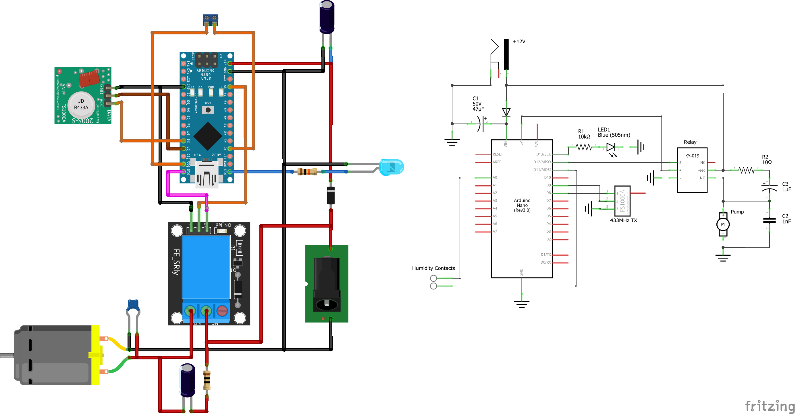

# Low-Water-Level Pump

## BOM
* RUNCCI-YUN Aquarium Pump 385: https://www.amazon.de/gp/product/B0CB3QGFX2
* Arduino Nano: https://www.amazon.de/gp/product/B01LWSJBTD
* Relay: https://www.amazon.de/gp/product/B0CSJQZ89V
* FS1000A 433MHz Transmitter: https://www.amazon.de/gp/product/B07DJYK29J
* waterproof junction box: https://www.amazon.de/dp/B09BDTHPQQ
* barrel jack: https://www.amazon.de/dp/B07QPZTHDK
* 12V PSU: https://www.amazon.de/dp/B09KGXZX35
* through-hole components: see [schematics](schematics/schem.png)
* two M5 threaded inserts and stainless screws for the moisture sensing
* 85x55x25mm sponge
* PVC water hose (6-9mm): https://www.amazon.de/gp/product/B07P18XXY2
## 3D Print
* [LowWaterLevelPump.stl](3d_print/LowWaterLevelPump.stl)
## Schematics

## RF 433 MHz telemetry
The uptime and status of the pump is periodically send via the FS1000A module. The data is encoded in plain text json and transmitted via the [RadioHead Packet Radio library](https://www.airspayce.com/mikem/arduino/RadioHead/index.html). To pick up the messages you can use the [rtl_433](https://github.com/merbanan/rtl_433) project in combination with a supported SDR like an RTL2838 DVB-T stick.
